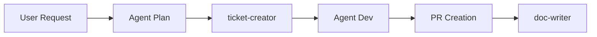
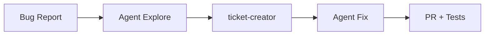

# MCP & Agents Spécialisés

Ce document décrit la configuration MCP (Model Context Protocol) et les agents spécialisés pour le projet Paris Sportif.

## MCP Servers Configurés

### 1. Linear (Gestion Tickets)

**Utilisation**: Création et gestion des tickets de développement.

```bash
# Environnement requis
LINEAR_API_KEY=lin_api_xxxxx
```

**Outils disponibles**:
- `list_issues` - Lister les tickets
- `get_issue` - Détails d'un ticket
- `create_issue` - Créer un ticket
- `update_issue` - Mettre à jour un ticket
- `list_teams` - Lister les équipes

### 2. Notion (Documentation)

**Utilisation**: Gestion de la documentation et des specs.

```bash
# Environnement requis
NOTION_API_KEY=secret_xxxxx
```

**Outils disponibles**:
- `notion-search` - Rechercher dans Notion
- `notion-fetch` - Récupérer une page
- `notion-create-pages` - Créer des pages
- `notion-update-page` - Mettre à jour une page

---

## Agents Spécialisés

### Agent: `ticket-creator`

**Rôle**: Créer des tickets Linear bien structurés à partir de requirements.

**Workflow**:
1. Analyse des requirements fournis
2. Structuration en format Linear (titre, description, labels, priorité)
3. Création du ticket via MCP Linear
4. Retour de l'URL du ticket créé

**Utilisation**:
```
Je veux créer un ticket pour [description de la feature]
```

### Agent: `doc-writer`

**Rôle**: Créer et mettre à jour la documentation Notion.

**Workflow**:
1. Analyse du contenu à documenter
2. Recherche de la page Notion cible
3. Création ou mise à jour via MCP Notion
4. Retour du lien vers la documentation

### Agent: `explore`

**Rôle**: Explorer le codebase pour comprendre l'architecture.

**Capacités**:
- Recherche de fichiers par pattern (Glob)
- Recherche de code par contenu (Grep)
- Lecture de fichiers (Read)
- Analyse de structure (Tree)

---

## Workflows Multi-Agents

### 1. Feature Development Workflow



**Étapes**:
1. **Plan**: Analyse de la demande, création du plan
2. **Ticket**: Création automatique du ticket Linear
3. **Dev**: Implémentation avec commits conventionnels
4. **PR**: Création de la Pull Request
5. **Doc**: Mise à jour de la documentation

### 2. Bug Triage Workflow



**Étapes**:
1. **Explore**: Analyse de l'erreur dans le code
2. **Ticket**: Création d'un bug ticket avec contexte
3. **Fix**: Proposition et implémentation de la solution
4. **PR**: PR avec tests de régression

---

## Configuration

### Fichier `.mcp.json` (racine du projet)

```json
{
  "mcpServers": {
    "linear": {
      "command": "npx",
      "args": ["-y", "@linear/mcp-server"],
      "env": {
        "LINEAR_API_KEY": "${LINEAR_API_KEY}"
      }
    },
    "notion": {
      "command": "npx",
      "args": ["-y", "@notionhq/mcp-server"],
      "env": {
        "NOTION_API_KEY": "${NOTION_API_KEY}"
      }
    }
  }
}
```

### Variables d'environnement requises

Ajouter dans `.env.local` ou `.envrc`:

```bash
export LINEAR_API_KEY="lin_api_xxxxx"
export NOTION_API_KEY="secret_xxxxx"
```

---

## Commandes Utiles

### Linear

```bash
# Lister les tickets en backlog
/linear list --state backlog

# Créer un ticket
/linear create --title "Bug: ..." --priority urgent

# Mettre à jour un ticket
/linear update PAR-123 --state "In Progress"
```

### Notion

```bash
# Rechercher dans Notion
/notion search "architecture"

# Créer une page
/notion create --parent "Documentation" --title "Nouvelle Page"
```

---

## Bonnes Pratiques

1. **Toujours créer un ticket** avant de commencer une feature/fix
2. **Mettre à jour le statut** du ticket (Backlog → In Progress → Done)
3. **Documenter les décisions** importantes dans Notion
4. **Utiliser les agents spécialisés** pour les tâches répétitives
5. **Vérifier les workflows** avant de les utiliser en production

## Troubleshooting

### MCP Server ne répond pas

```bash
# Vérifier que les API keys sont configurées
echo $LINEAR_API_KEY
echo $NOTION_API_KEY

# Redémarrer Claude Code
claude --restart
```

### Permissions insuffisantes

Vérifier que les API keys ont les scopes nécessaires:
- Linear: `read`, `write`, `issues:create`
- Notion: `read`, `write`, `pages:create`
