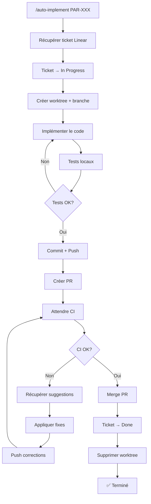
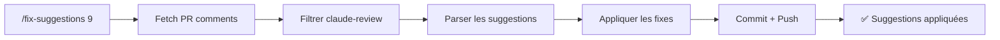

# Workflows Automatisés

Ce document décrit les workflows automatisés disponibles via les skills Claude Code.

## Skills Disponibles

| Skill | Description | Argument |
|-------|-------------|----------|
| `/auto-implement` | Workflow complet: ticket → code → PR → merge | `PAR-XXX` |
| `/ticket` | Créer un ticket Linear structuré | Description texte |
| `/backlog` | Voir les tickets en attente | - |
| `/done` | Finaliser: merge + ticket done + cleanup | `PR#` ou `PAR-XXX` |
| `/fix-suggestions` | Appliquer les suggestions de review | `PR#` |
| `/review-and-fix` | Analyser et corriger une PR | `PR#` |

---

## Workflow Principal: `/auto-implement`



### Exemple d'utilisation

```bash
# L'utilisateur dit simplement:
/auto-implement PAR-132

# Claude fait automatiquement:
# 1. Récupère PAR-132 depuis Linear
# 2. Crée worktree: /paris-sportif-worktrees/par-132
# 3. Implémente les corrections de linting
# 4. Lance ruff --fix, black, mypy
# 5. Commit et push
# 6. Crée la PR
# 7. Attend les CI (5min max)
# 8. Si claude-review suggère des fixes → les applique
# 9. Merge la PR
# 10. Passe PAR-132 en Done
# 11. Supprime le worktree
# 12. Confirme "✅ PAR-132 terminé!"
```

---

## Workflow de Review: `/fix-suggestions`

Quand une PR a des suggestions du bot claude-review:



### Suggestions auto-appliquées

| Type | Action |
|------|--------|
| Ligne trop longue | Reformater |
| Import inutilisé | Supprimer |
| Type manquant | Ajouter annotation |
| Trailing whitespace | Supprimer |
| Formatting | Black/Prettier |

### Suggestions demandant confirmation

- Changements d'architecture
- Suppression de code
- Modification de logique métier

---

## Workflow Création Ticket: `/ticket`

```bash
# Input simple
/ticket Ajouter un système de notifications push

# Output automatique
✅ Ticket créé: PAR-142
   Titre: feat(frontend): add push notification system
   Priority: Medium
   Labels: Feature
   URL: https://linear.app/paris-sportif/issue/PAR-142
```

---

## Configuration Requise

### MCP Servers (`.mcp.json`)

```json
{
  "mcpServers": {
    "linear": { "...": "..." },
    "notion": { "...": "..." }
  }
}
```

### Variables d'environnement

```bash
LINEAR_API_KEY=lin_api_xxx
NOTION_API_KEY=secret_xxx
```

### Permissions GitHub

Token avec scopes: `repo`, `workflow`

---

## Commandes de Fallback

Si un skill ne fonctionne pas, utiliser les commandes manuelles:

```bash
# Créer ticket
mcp__linear__create_issue

# Voir backlog
mcp__linear__list_issues --state backlog

# Merger PR
gh pr merge <PR> --squash --delete-branch

# Cleanup worktree
git worktree remove <path> --force
```
